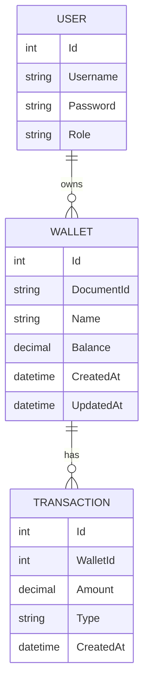

# 📊 Wallet API

API REST para gestionar billeteras digitales y transferencias de saldo. Desarrollada con **.NET 8**, **Clean Architecture**, **Entity Framework Core**, **JWT Authentication**, **FluentValidation** y **Swagger**.

## 📌 Características
- CRUD de billeteras.
- Transferencias de saldo entre billeteras.
- Autenticación con JWT.
- Validación de entradas con FluentValidation.
- Documentación con Swagger.
- Manejo centralizado de errores con Middleware.

## 📋 Requisitos previos

Asegúrate de tener instalado lo siguiente:

- .NET 8 SDK: [Descargar](https://dotnet.microsoft.com/download)
- SQL Server (o cualquier base de datos compatible con EF Core).

## 🚀 Instalación y ejecución del proyecto

### 1. Clonar el repositorio
```bash
git clone https://github.com/tuusuario/wallet-api.git
cd wallet-api
```

### 2. Restaurar las dependencias
```bash
dotnet restore
```

### 3. Configurar la conexión a la base de datos

Edita el archivo `appsettings.json` en el proyecto `WebApi`:

```json
"ConnectionStrings": {
  "DefaultConnection": "Server=localhost;Database=WalletDb;User Id=tuUsuario;Password=tuPassword;TrustServerCertificate=True;"
},
"Jwt": {
  "Key": "tu_clave_secreta",
  "Issuer": "walletapi",
  "Audience": "walletapi_users"
}
```

### 4. Crear las migraciones y actualizar la base de datos
```bash
# En Visual Studio (Consola del Administrador de Paquetes)
Add-Migration InitialCreate -Project Infrastructure -StartupProject WebApi
Update-Database -Project Infrastructure -StartupProject WebApi
```

O desde la terminal:

```bash
dotnet ef migrations add InitialCreate --project Infrastructure --startup-project WebApi
dotnet ef database update --project Infrastructure --startup-project WebApi
```

### 5. Ejecutar la API
```bash
dotnet run --project WebApi
```

La API estará disponible en: [http://localhost:5000](http://localhost:5000)

## 🧪 Ejecutar las pruebas

Para ejecutar las pruebas unitarias e integradas:
```bash
dotnet test
```

## 📖 Endpoints principales

### 1. Autenticación (Obtener JWT)
```http
POST /api/auth/login
```
**Body:**
```json
{
  "username": "usuario",
  "password": "clave"
}
```

### 2. Crear una billetera
```http
POST /api/wallet
```
**Body:**
```json
{
  "documentId": "12345678",
  "name": "Alan Huanca",
  "balance": 500
}
```

### 3. Transferir saldo entre billeteras
```http
POST /api/wallet/transfer
```
**Body:**
```json
{
  "fromWalletId": 1,
  "toWalletId": 2,
  "amount": 100
}
```

## 📊 Diagrama ER (Entidad-Relación)



## 📚 Documentación con Swagger
Accede a la documentación completa e interactiva en:

```
http://localhost:5000/swagger
```

## 📬 Contacto
**Autor:** Alan Huanca

¡Gracias por utilizar Wallet API! 🎉

